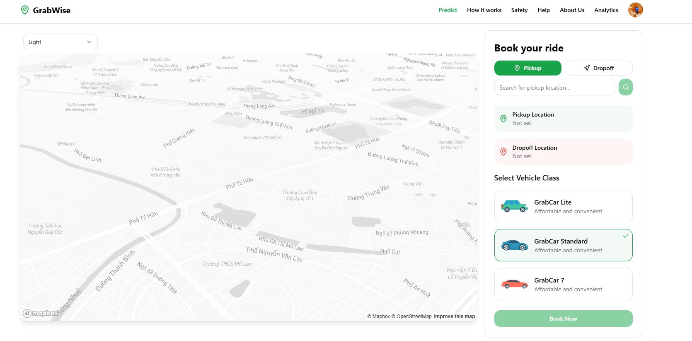
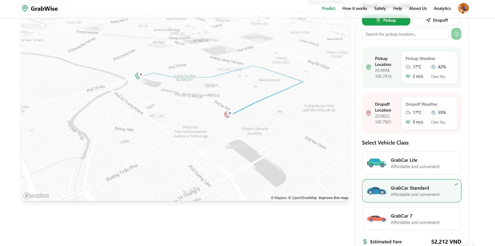
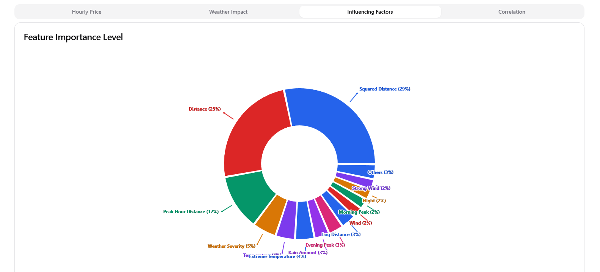
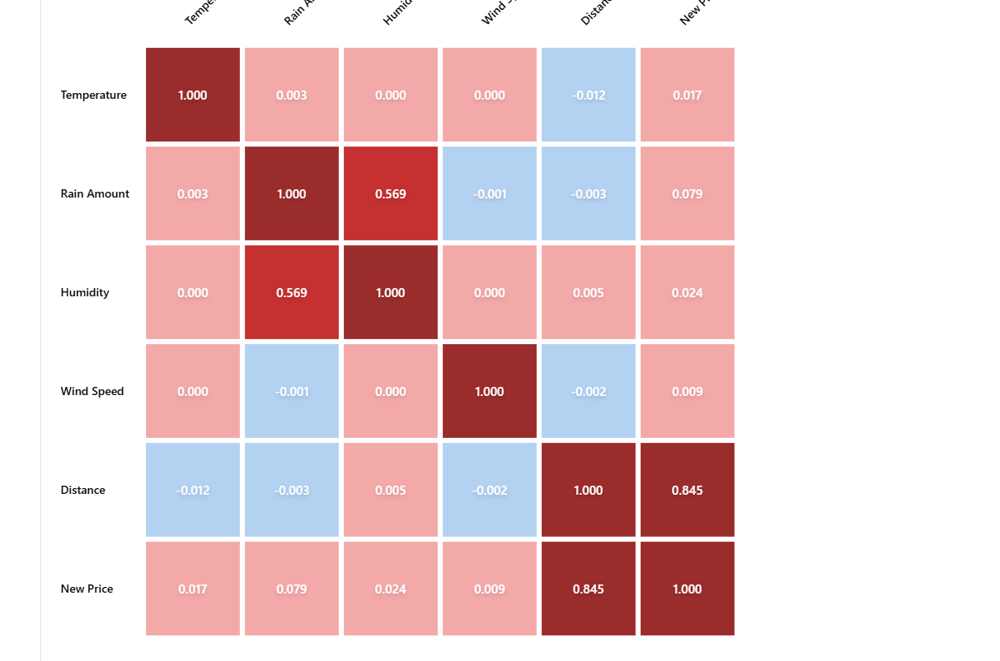
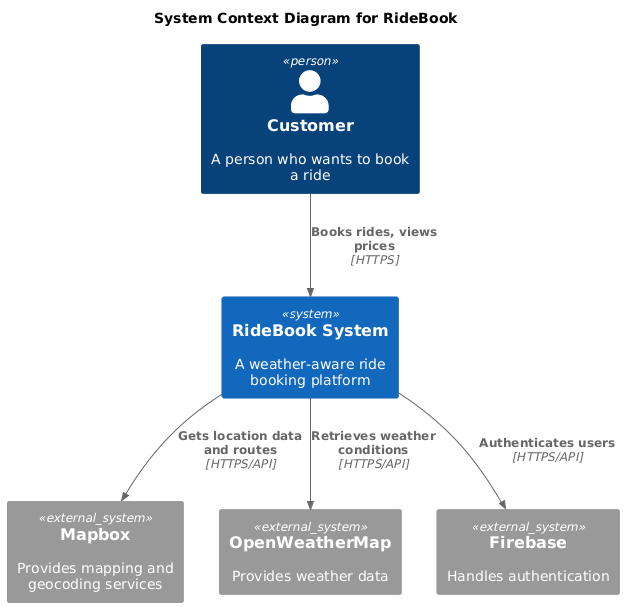
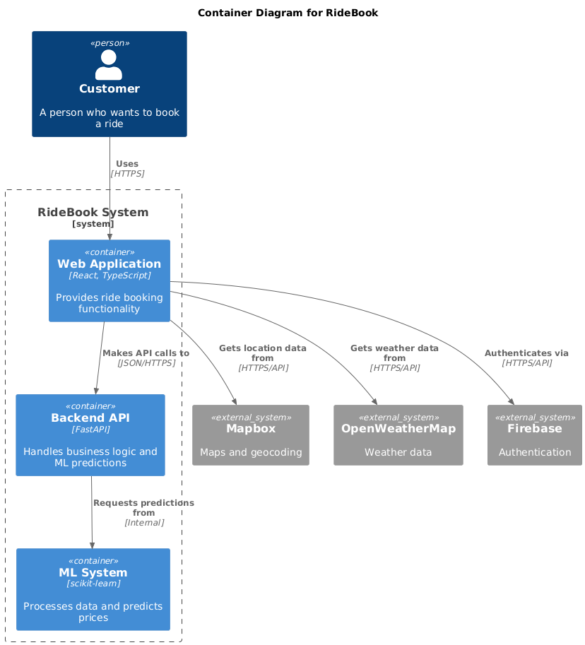
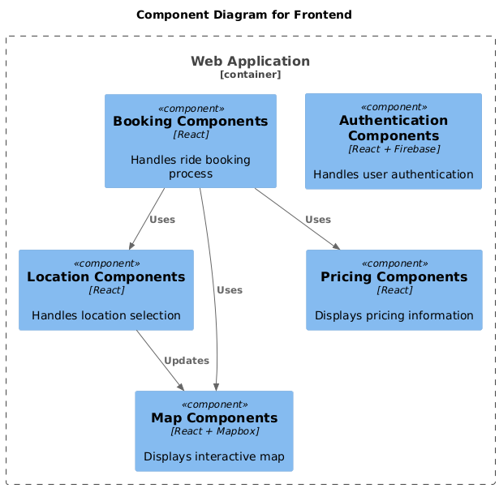
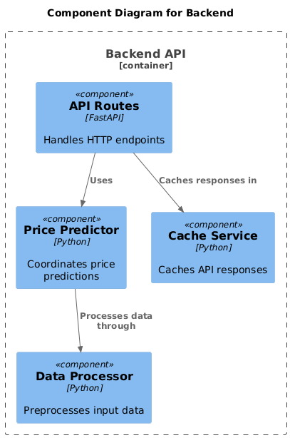
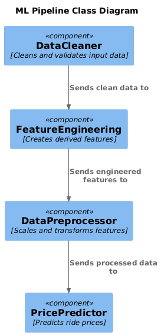

# GrabWise

A modern, weather-aware ride booking platform that calculates fares based on distance and weather conditions.

## Demo









## Business Requirements

1. **User Experience**
   - Intuitive location selection
   - Real-time price estimates
   - Transparent weather impact on pricing
   - Multiple vehicle options

2. **Pricing Logic**
   - Base fare calculation
   - Weather condition adjustments
   - Vehicle class multipliers
   - Distance-based pricing

3. **Booking Flow**
   - Location selection
   - Vehicle class selection
   - Price preview
   - Booking confirmation
   - History tracking

4. **Safety & Security**
   - User authentication
   - Secure data storage
   - Privacy protection


## Features

- 🗺️ Interactive Map Interface
  - Real-time location selection
  - Visual route display
  - Distance calculation
  - Multiple map styles
- 🌤️ Weather Integration
  - Real-time weather data for pickup and dropoff locations
  - Weather-aware pricing
- 🚗 Vehicle Options
  - Multiple vehicle classes (Standard, Premium, Business)
  - Class-specific pricing
- 📱 Responsive Design
  - Works seamlessly on desktop and mobile devices
- 🔐 User Authentication
  - Google sign-in integration
  - Booking history tracking
- 💰 Smart Pricing
  - ML-powered price prediction based on:
    - Distance
    - Weather conditions
    - Vehicle class
    - Time of day

## Diagram




## Project Structure

### Frontend

```
src/
├── components/         # Reusable UI components
│   ├── booking/       # Booking-related components
│   ├── location/      # Location search components
│   ├── map/          # Map-related components
│   └── ui/           # shadcn/ui components
├── contexts/          # React contexts
├── hooks/             # Custom React hooks
├── lib/              # Utility libraries
├── pages/            # Main application pages
├── services/         # API and external service integrations
└── types/            # TypeScript type definitions
```



### Backend

```

backend/
├── api/
│   ├── __init__.py
│   ├── routes.py          # API routes
│   └── schemas.py         # Pydantic schemas
├── core/
│   ├── __init__.py
│   ├── config.py          # Environment configuration
│   └── logger.py          # Logger configuration
├── ml/
│   ├── __init__.py
│   ├── model.py           # ML model
│   ├── preprocessor.py    # Data preprocessing
│   ├── cab_rides.csv      # Sample dataset
│   └── weather.csv        # Sample dataset
├── models/
│   ├── feature_columns.joblib  # Feature columns for ML model
│   ├── preprocessor.joblib     # Preprocessor for ML model
│   └── price_model.joblib      # Trained ML model
├── utils/
│   ├── __init__.py
│   └── cache.py          # Cache utility for API responses
└── main.py               # FastAPI application

```



## Tech Stack

### Frontend

- **Frontend Framework**: React with TypeScript
- **Styling**: Tailwind CSS
- **UI Components**: shadcn/ui
- **Maps**: Mapbox GL JS
- **Authentication**: Firebase
- **Animation**: Framer Motion
- **API Integration**:
  - OpenWeatherMap API - For weather data
  - Mapbox Geocoding API - For location search

### Backend

- **Backend Framework**: FastAPI
- **API Client**: HTTPx
- **Data Validation**: Pydantic
- **Logging**: Python logging module
- **Caching**: CacheControl
- **API Documentation**: Swagger UI


### Machine Learning Stack



- **Core ML**: Gradient Boosting (scikit-learn `GradientBoostingRegressor`)
- **Data Processing**: Pandas, NumPy
- **Model Serialization**: Joblib
- **Data Preprocessing**: StandardScaler
- **Type Hints**: Python typing module

## Model Details

### Algorithm Choice

- **Selected Algorithm**: Gradient Boosting Regressor
- **Configuration**:
  - `n_estimators`: 100
  - `learning_rate`: 0.1
  - `max_depth`: 5
  - `random_state`: 42

### Feature Engineering

#### Core Features

- `distance`
- `source_temp`
- `source_clouds`
- `source_pressure`
- `source_rain`
- `source_humidity`
- `source_wind`
- `destination_temp`
- `destination_clouds`
- `destination_pressure`
- `destination_rain`
- `destination_humidity`
- `destination_wind`

#### Engineered Features

- `temp_difference` (between source and destination)
- `weather_severity` scores
- `time-based features` (hour, is_rush_hour)

### Data Processing

#### Data Cleaning

- Removal of invalid prices (`price > 0`)
- Removal of invalid distances (`distance > 0`)
- Handling of infinite values
- Missing value imputation using medians
- Validation of critical columns

### Model Pipeline

1. **Data cleaning** (`DataCleaner` class)
2. **Feature engineering** (`FeatureEngineering` class)
3. **Data preprocessing** (`DataPreprocessor` class)
4. **Model training** (`PricePredictor` class)

### Data Sources

- `cab_rides.csv`: Ride information
- `weather.csv`: Weather conditions


## Installation

1. Clone the repository:
```bash
git clone <repository-url>
cd (repository-name)
```

2. Install dependencies:
```bash
//Go to the frontend directory
cd frontend
npm install

//Go to the backend directory
cd backend
python install -r requirements.txt
```

3. Start the development server:
```bash

//Go to the frontend directory
cd frontend
npm run dev 

//Now it available on localhost:5173

//Go to the backend directory

cd backend
python main.py
```

